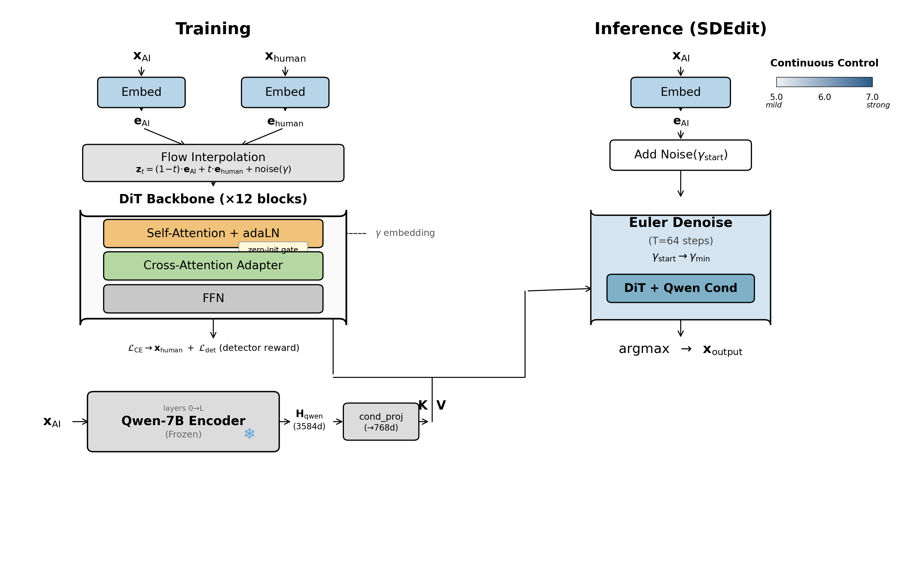
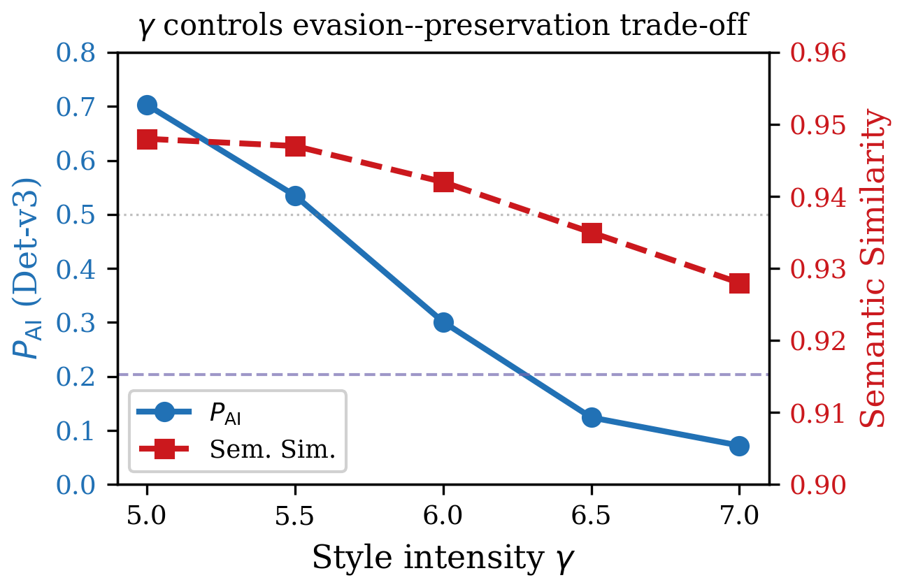
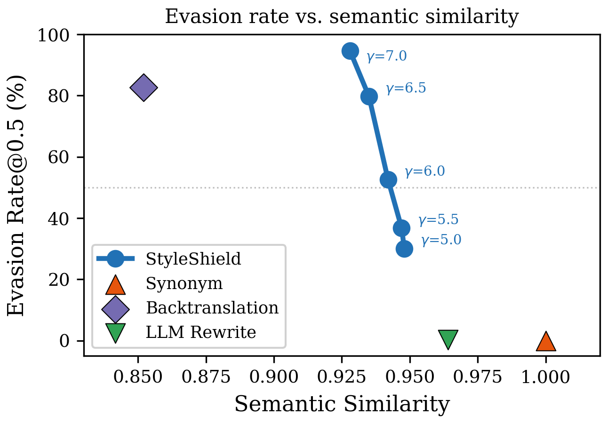

# StyleShield

**Continuous and Controllable Style Transfer for Evading AI-Generated Content Detectors**

> EMNLP 2026 Submission

<p align="center">
  
</p>

## What is StyleShield?

Current AIGC detectors are widely deployed in academic integrity checks, content moderation, and hiring pipelines — yet their robustness has never been independently audited. **StyleShield** is a diagnostic framework that exposes this fragility through continuous, controllable text style transfer.

Built on a Diffusion Transformer (DiT) backbone with flow matching, StyleShield injects frozen Qwen-7B semantic representations via zero-initialized cross-attention adapters. A single parameter **γ** provides fine-grained control over the evasion–preservation trade-off — something fundamentally inaccessible to discrete-token methods.

### Key Results

| | Det-v3 (train) | Det-v2 | ANX-BERT | GPT2-Det | Sim | PPL |
|---|---|---|---|---|---|---|
| **γ = 6.5** | 87.6% evade | 99.3% | 96.1% | 98.7% | 0.935 | 21.1 |
| **γ = 7.0** | 94.6% evade | 100% | 99.0% | 99.1% | 0.928 | 21.2 |

<p align="center">
  
  
</p>

**Left**: γ provides smooth, monotonic control over P(AI) and semantic similarity.
**Right**: StyleShield Pareto-dominates all baselines at every operating point.

## Architecture

- **Backbone**: 12-block DiT (~85M params) pretrained with flow matching (LangFlow)
- **Conditioning**: Zero-initialized cross-attention adapters injecting frozen Qwen-2.5-7B-Instruct hidden states (layer 14 of 28)
- **Training**: Denoising CE loss + detector-in-the-loop reward (λ=0.1)
- **Inference**: SDEdit paradigm — noise at level γ, denoise with 64 Euler steps
- **Trainable params**: ~113M (backbone + adapters). Qwen (7B) is fully frozen.

## Quick Start

```bash
pip install -r requirements.txt

python scripts/transfer.py \
    --ckpt checkpoints/step_30000.pt \
    --gamma 6.5 \
    --input "你要转换的AI生成文本"
```

## Project Structure

```
src/
  model.py            DiT backbone + cross-attention adapters
  qwen_encoder.py     Frozen Qwen hidden state extraction
  dataset.py          AI-human parallel pair dataset
  config.py           All hyperparameters
scripts/
  train_styleflow.py  DDP training (128×A800)
  transfer.py         Single-sample inference
  eval_acl.py         Multi-detector evaluation
  allocator_sf.py     RateAudit: long-document scheduling
configs/              Training YAML configs (full model + 5 ablations)
paper/                LaTeX source
```

## Checkpoints

Model weights are available on HuggingFace Hub (link upon acceptance).

| Checkpoint | Description |
|---|---|
| `step_30000.pt` | Full model (multi-domain, Qwen layer 14) |
| `ablation_no_detector/` | A2: without detector reward |
| `ablation_split7/` | A3: Qwen split layer 7 |
| `ablation_split21/` | A4: Qwen split layer 21 |

## RateAudit

StyleShield includes **RateAudit**, a document-level diagnostic that demonstrates any pre-specified detection rate can be achieved on arbitrarily long texts. Given a target rate (e.g., 30%), RateAudit greedily rewrites only the highest-P(AI) chunks, shifting the aggregate score while leaving the majority of the document untouched.

## Citation

```bibtex
@inproceedings{styleshield2026,
  title={StyleShield: Continuous and Controllable Style Transfer
         for Evading AI-Generated Content Detectors},
  author={Anonymous},
  booktitle={EMNLP},
  year={2026}
}
```

## License

MIT
